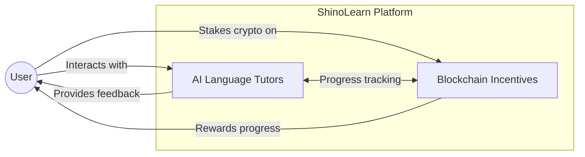
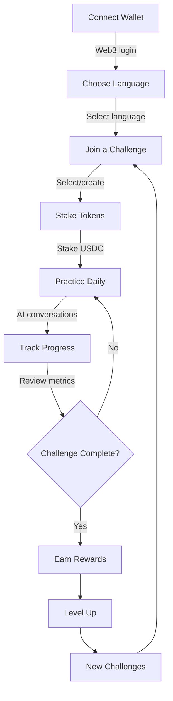
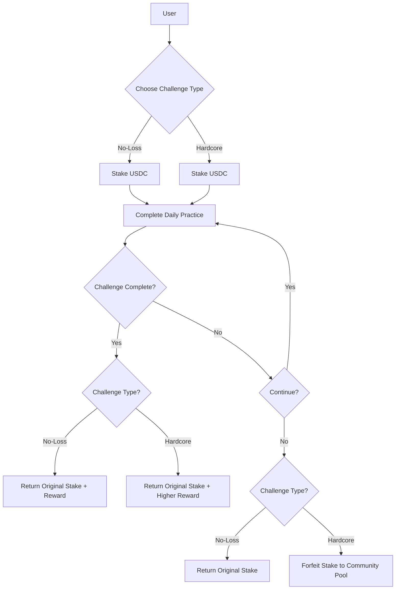
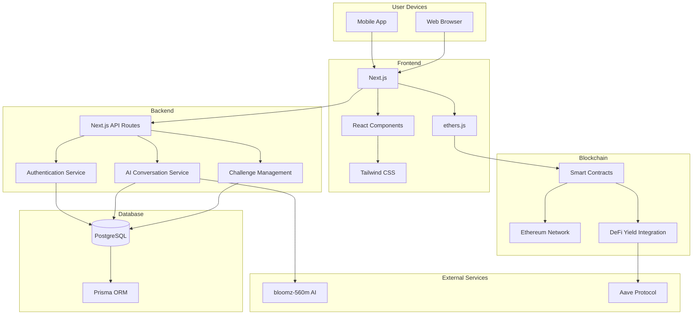

# ShinoLearn 🥷🧑‍💻

> **Web3-Powered Language Learning Platform**

[](LICENSE)

## 🚀 Overview

ShinoLearn combines AI-powered language learning with blockchain incentives, creating a revolutionary approach to mastering new languages. Users stake cryptocurrency on learning challenges, earning rewards for consistent practice and achievement.

*~Every word is a weapon — wield it well.*

## ✨ Core Concept



ShinoLearn combines two innovative approaches:

- **AI-Powered Practice**: Engage in natural conversations with AI avatars that provide real-time feedback tailored to your proficiency level
- **Blockchain Incentives**: Stake cryptocurrency on your learning journey, creating tangible motivation that rewards commitment and consistency

## 💡 Key Features

### 🔐 Web3 Authentication
- Connect securely with MetaMask
- JWT-based session management
- Personalized language learning profiles

### 🗣️ AI Learning Experience
- Interactive conversations with intelligent AI tutors
- Real-time pronunciation and grammar feedback
- Adaptive difficulty based on your progress

## 💪 The problem ShinoLearn solves

- **Low Engagement in Learning** – Many people struggle to stay consistent with self-education due to lack of external motivation or rewards.
- **Underutilized Yield in DeFi** – DeFi yield is often used for passive income but rarely leveraged to incentivize productive activities like learning.
- **Inefficient Incentives in EdTech** – Traditional learning platforms rely on certifications and gamification, but they don't offer tangible financial incentives for continued participation.

## 🔄 How It Works



1. **Connect Wallet**: Securely log in with your Web3 wallet
2. **Choose Language**: Select your target language and proficiency level
3. **Join a Challenge**: Browse available challenges or create your own
4. **Stake Tokens**: Commit to your learning goals by staking USDC
5. **Practice Daily**: Engage with AI tutors in natural conversations
6. **Track Progress**: Monitor your improvement with detailed metrics
7. **Complete Challenge**: Earn back your stake plus additional rewards
8. **Level Up**: Build a learning streak and climb the leaderboards

<!-- ## 🎥 Demo

[](https://youtu.be/placeholder)
*Click to watch our platform demo* -->

### 🏆 Challenge System



Choose your challenge type:
- **No-Loss Challenges**: Stake returned upon completion
- **Hardcore Challenges**: Higher rewards, but stakes forfeited on failure

Track daily progress with AI-based evaluation metrics that measure real proficiency gains.

### 💰 Financial Incentives
- USDC staking via secure smart contracts
- Yield generation through integration with DeFi protocols
- Community reward pool for active participants

### 👥 Social Features
- Achievement system with digital badges
- Community leaderboards
- Group challenges and learning cohorts

## 📱 User Interface

<div align="center">
  
      


</div>


<div align="center">
        
  


</div>

<div align="center">
        

  


</div>

## 🚀 Getting Started

Ready to revolutionize your language learning journey? Follow these steps:

1. **Connect Your Wallet**: Link your MetaMask or compatible Web3 wallet
2. **Choose Your Language**: Select from our growing collection of supported languages
3. **Join Your First Challenge**: Start with a beginner-friendly No-Loss Challenge
4. **Practice Daily**: Engage with our AI tutors and track your progress

## 🛠️ Technical Architecture



### Frontend
- **Framework**: Next.js (App Router)
- **Styling**: Tailwind CSS with custom theming
- **State Management**: React Context API
- **Web3 Integration**: ethers.js

### Backend
- **API**: Next.js API Routes
- **Database**: PostgreSQL with Prisma ORM
- **Authentication**: JWT with Web3 signature verification
- **AI Integration**: bloomz-560m, Deepseek API

### Blockchain
- **Network**: Ethereum
- **Supported Wallet**: MetaMask
- **Smart Contracts**: Solidity (ERC-20 compatible)
- **DeFi Integration**: Aave protocol for yield generation

## 🔧 Installation & Setup

### Prerequisites
- Node.js 18+
- PostgreSQL 14+
- MetaMask or compatible Web3 wallet

### Local Development
```bash
# Clone the repository
git clone https://github.com/tushar-agarwal7/HackIndia-Spark-5-2025-ShinoDevs.git
cd HackIndia-Spark-5-2025-ShinoDevs

# Install dependencies
npm install

# Set up environment variables

# Run database migrations
npx prisma migrate dev

# Start development server
npm run dev
```

### Smart Contract Deployment
```bash
# Navigate to contracts directory
cd shinobi-contracts

# Install dependencies
npm install

```

## 👥 Our Team

ShinoLearn is built by a passionate team of language educators, AI specialists, and blockchain developers dedicated to revolutionizing language learning through technology.

<div align="center">
  
  <p><em>Meet the minds behind ShinoLearn</em></p>
</div>

