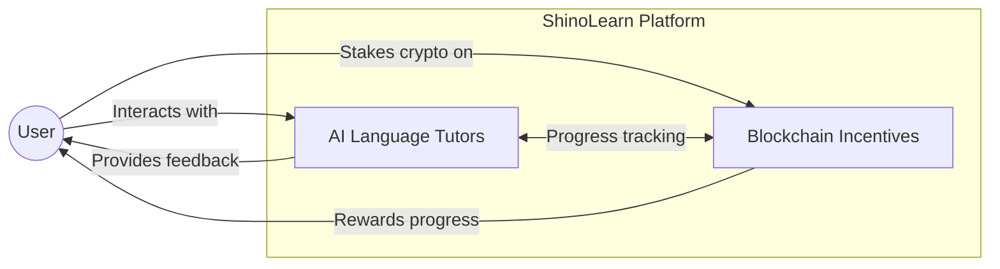
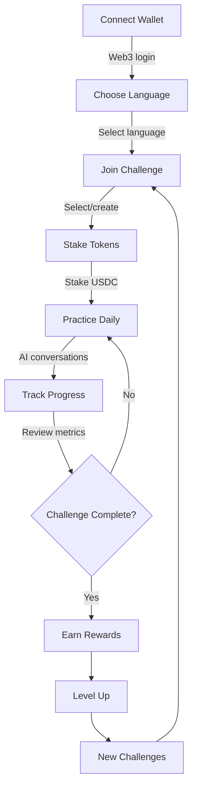
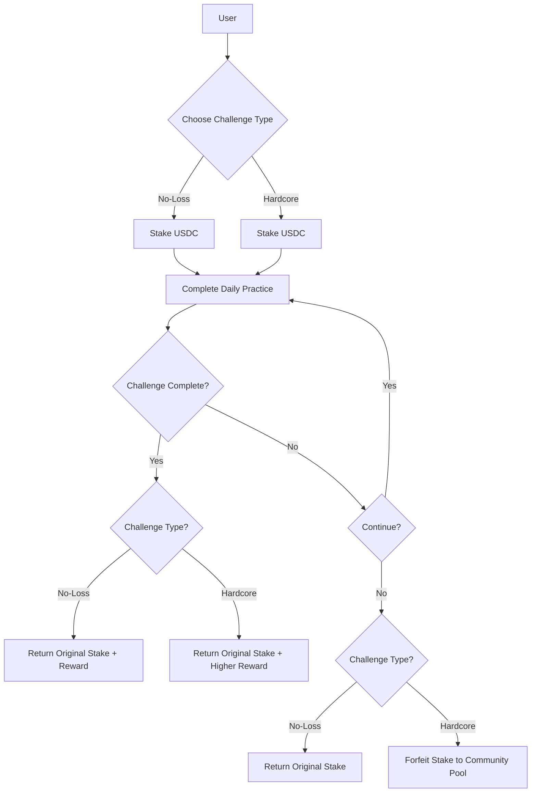
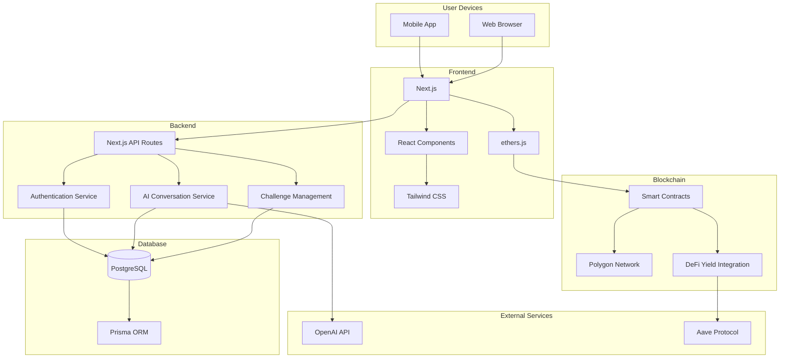
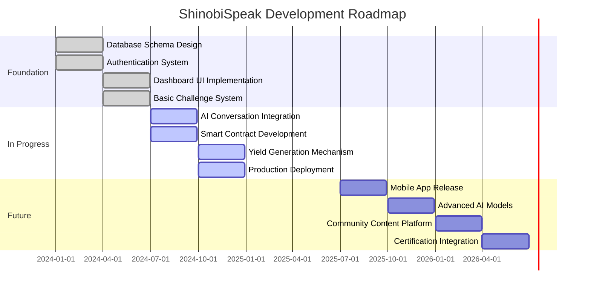

# ShinoLearn 🥷🔤

> **Web3-Powered Language Learning Platform**

[](LICENSE)
[](https://github.com/tushar-agarwal7/robolearn/stargazers)
[](https://github.com/tushar-agarwal7/robolearn/issues)
[](https://github.com/tushar-agarwal7/robolearn/commits/main)

## 🚀 Overview

ShinoLearn merges AI-powered language learning with blockchain incentives, creating a revolutionary approach to mastering new languages. Users stake cryptocurrency on learning challenges, earning rewards for consistent practice and achievement.


*Platform overview showing dashboard, AI interaction, and staking features*

## ✨ Core Concept



ShinoLearn combines two innovative approaches:

- **AI-Powered Practice**: Engage in natural conversations with AI avatars that provide real-time feedback tailored to your proficiency level
- **Blockchain Incentives**: Stake cryptocurrency on your learning journey, creating tangible motivation that rewards commitment and consistency

## 💡 Key Features

### 🔐 Web3 Authentication
- Connect securely with MetaMask
- JWT-based session management
- Personalized language learning profiles

### 🗣️ AI Learning Experience
- Interactive conversations with intelligent AI tutors
- Real-time pronunciation and grammar feedback
- Adaptive difficulty based on your progress


## 🔄 How It Works



1. **Connect Wallet**: Securely log in with your Web3 wallet
2. **Choose Language**: Select your target language and proficiency level
3. **Join Challenge**: Browse available challenges or create your own
4. **Stake Tokens**: Commit to your learning goals by staking USDC
5. **Practice Daily**: Engage with AI tutors in natural conversations
6. **Track Progress**: Monitor your improvement with detailed metrics
7. **Complete Challenge**: Earn back your stake plus additional rewards
8. **Level Up**: Build a learning streak and climb the leaderboards

### 🏆 Challenge System



Choose your challenge type:
- **No-Loss Challenges**: Stake returned upon completion
- **Hardcore Challenges**: Higher rewards, but stakes forfeited on failure

Track daily progress with AI-based evaluation metrics that measure real proficiency gains.

### 💰 Financial Incentives
- USDC staking via secure smart contracts
- Yield generation through integration with DeFi protocols
- Community reward pool for active participants

### 👥 Social Features
- Achievement system with digital badges
- Community leaderboards
- Group challenges and learning cohorts

## 📱 User Interface

<div align="center">
  
  <p><em>Dashboard showing language progress, active challenges, and staking overview</em></p>
</div>

<div align="center">
  
  <p><em>AI conversation interface with real-time feedback visualization</em></p>
</div>

<div align="center">
  
  <p><em>Challenge staking interface with reward projections</em></p>
</div>


## 🎥 Demo

[](https://youtu.be/placeholder)
*Click to watch our platform demo (placeholder)*


## 🛠️ Technical Architecture



### Frontend
- **Framework**: Next.js (App Router)
- **Styling**: Tailwind CSS with custom theming
- **State Management**: React Context API
- **Web3 Integration**: ethers.js

### Backend
- **API**: Next.js API Routes
- **Database**: PostgreSQL with Prisma ORM
- **Authentication**: JWT with Web3 signature verification
- **AI Integration**: OpenAI API

### Blockchain
- **Primary Network**: Polygon
- **Secondary Network**: Ethereum
- **Smart Contracts**: Solidity (ERC-20 compatible)
- **DeFi Integration**: Aave protocol for yield generation


## 🔧 Installation & Setup

### Prerequisites
- Node.js 18+
- PostgreSQL 14+
- MetaMask or compatible Web3 wallet

### Local Development
```bash
# Clone the repository
git clone https://github.com/shinobispeak/platform.git
cd platform

# Install dependencies
npm install

# Set up environment variables
cp .env.example .env.local
# Edit .env.local with your configuration

# Run database migrations
npx prisma migrate dev

# Start development server
npm run dev
```

### Smart Contract Deployment
```bash
# Navigate to contracts directory
cd contracts

# Install dependencies
npm install

# Compile contracts
npx hardhat compile

# Deploy to test network
npx hardhat run scripts/deploy.js --network mumbai
```

## 📈 Progress & Roadmap



### Completed ✅
- Database schema design
- Authentication system with wallet integration
- Dashboard UI design and implementation
- Basic challenge system structure

### In Progress 🚧
- AI conversation integration
- Smart contract development and testing
- Yield generation mechanism
- Production deployment and scaling

### Future Plans 🔮
- **Q3 2025**: Mobile app release
- **Q4 2025**: Advanced AI conversation models
- **Q1 2026**: Community-created content platform
- **Q2 2026**: Integration with certification programs


## 💪 Why ShinoLearn?

ShinoLearn stands apart from traditional language learning platforms by:

- **Financial Incentives**: Tangible rewards for consistency and achievement
- **Self-Motivation System**: Stakes create accountability and commitment
- **Natural Conversation Practice**: AI tutors that adapt to your unique needs
- **Web3 + AI Synergy**: Combining cutting-edge technologies for optimal learning
- **Community Focus**: Learn alongside others with similar goals

## 👥 Our Team

<div align="center">
  
  <p><em>Our diverse team of language educators, AI specialists, and blockchain developers</em></p>
</div>

## 🤝 Contributing

We welcome contributions from the community! Please check our [CONTRIBUTING.md](CONTRIBUTING.md) guide to get started.

1. Fork the project
2. Create your feature branch: `git checkout -b feature/amazing-feature`
3. Commit your changes: `git commit -m 'Add some amazing feature'`
4. Push to the branch: `git push origin feature/amazing-feature`
5. Open a Pull Request

## 📄 License

This project is licensed under the MIT License - see the [LICENSE](LICENSE) file for details.

## 🙏 Acknowledgements

ShinoLearn builds on the foundations laid by many incredible open-source projects:

- [OpenAI](https://openai.com/) for conversation AI models
- [Polygon](https://polygon.technology/) for efficient blockchain infrastructure
- [Next.js](https://nextjs.org/) for the frontend framework
- [Prisma](https://www.prisma.io/) for database management
- [Tailwind CSS](https://tailwindcss.com/) for styling

---

<div align="center">
  <p>Connect with ShinoLearn</p>
  <a href="https://twitter.com/shinobispeak"></a>
  <a href="https://discord.gg/shinobispeak"></a>
  <a href="https://shinobispeak.medium.com"></a>
</div>